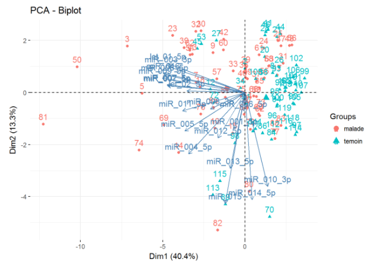

# OMICS data

This repository group several small project realized on Omics data.

(Meta)genomic, metabolomic and QPCR data are analyzed using various method such as
multiple testing, alpha/beta-diversity, PC(o)A, hierarchical, PLS-DA, and more.

